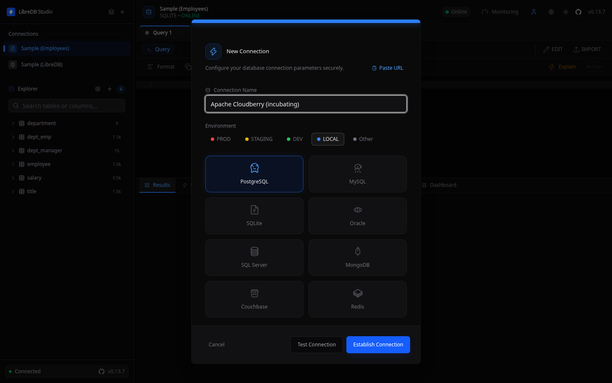
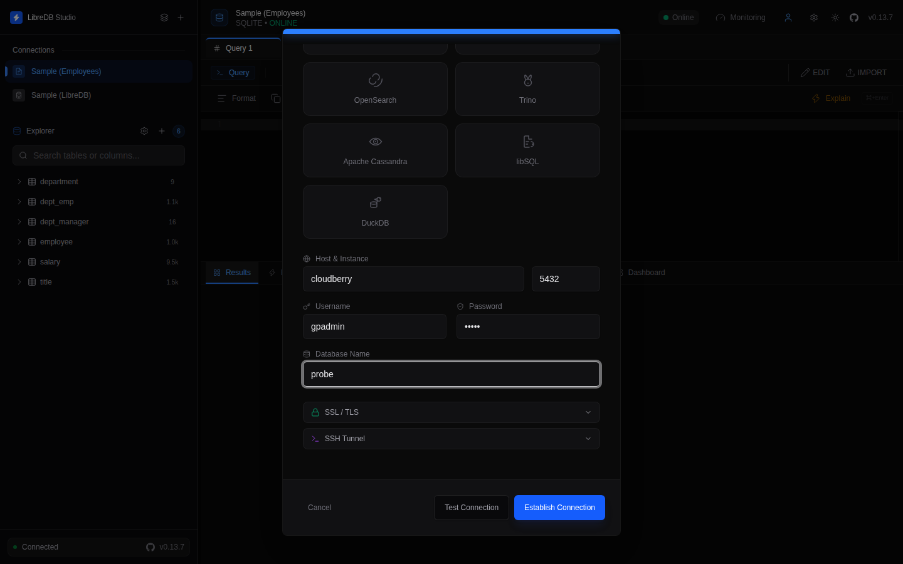
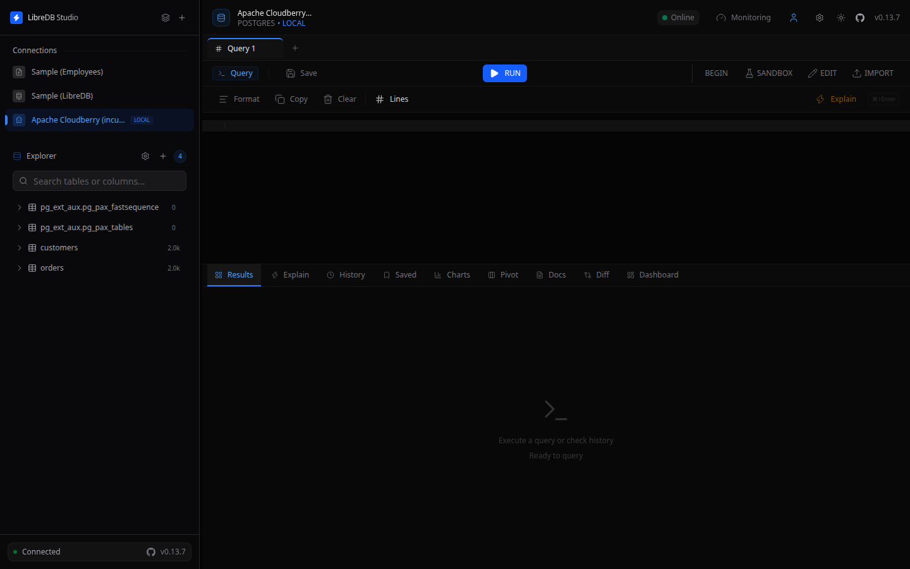
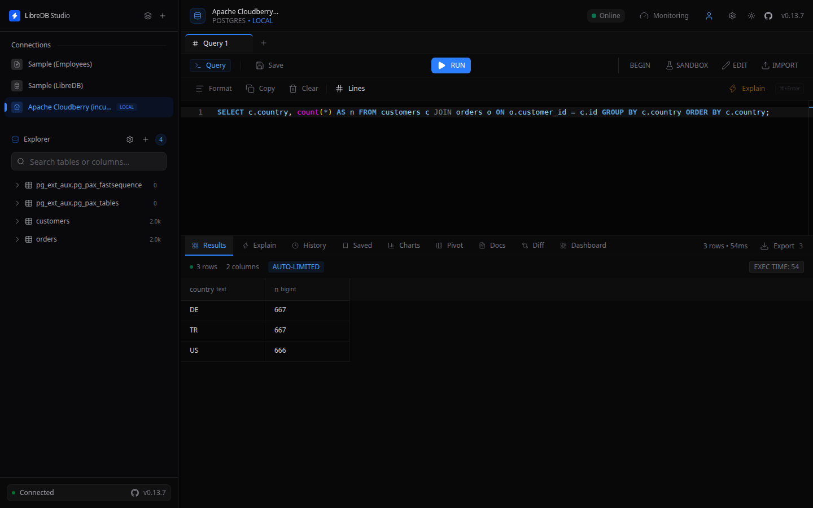

# LibreDB Studio

[LibreDB Studio](https://libredb.org) is an open source, web-based SQL IDE with a query editor, an object browser, and a monitoring dashboard. It supports seventeen database engines, including PostgreSQL, MySQL, Oracle, and ClickHouse, from a single workspace. It connects to Apache Cloudberry over the PostgreSQL wire protocol, the same way it connects to PostgreSQL itself.

## Prerequisites

- Apache Cloudberry is deployed with proper database access permissions set in `pg_hba.conf`. These steps were verified against Apache Cloudberry 2.1.0-incubating.
- LibreDB Studio is installed and running. It is not a desktop download: run it as a container, a Helm chart, or with `npx @libredb/studio`.
- The coordinator host, port, database name, and a role to connect as.

## Steps

1. Open LibreDB Studio in your browser and sign in.

2. Click the **+** button next to the LibreDB Studio logo to open the New Connection dialog.

3. Name the connection and select **PostgreSQL** as the connection type. Cloudberry has no separate connection type of its own: it speaks the PostgreSQL wire protocol, so the PostgreSQL driver is the correct choice.

4. Fill in the coordinator host and port, along with your username, password, and database name.

5. Click **Test Connection** to verify, then **Establish Connection**.

The connection appears in the sidebar, with the object browser on the left. Two internal tables, `pg_ext_aux.pg_pax_fastsequence` and `pg_ext_aux.pg_pax_tables`, are listed alongside your own tables.

You can now browse schemas and run queries, including joins and aggregates, from the editor.

